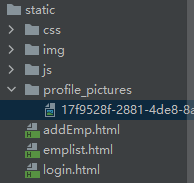
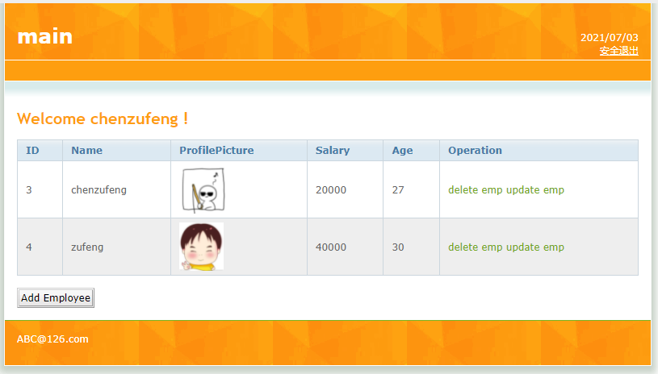
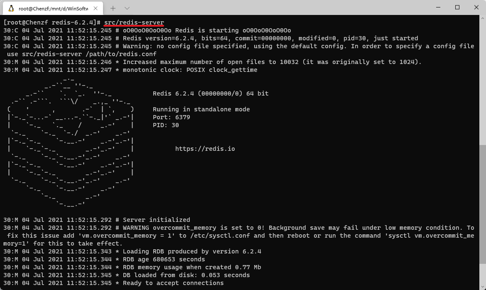

# 员工添加

## 在pom中添加依赖

由于在添加员工时，需要上传头像，因此需要添加文件上传依赖，并且需要对文件进行处理：

```xml
<dependency>
    <groupId>commons-fileupload</groupId>
    <artifactId>commons-fileupload</artifactId>
    <version>1.4</version>
</dependency>

<dependency>
    <groupId>commons-io</groupId>
    <artifactId>commons-io</artifactId>
    <version>2.6</version>
</dependency>
```

然后点击`Load Maven Changes`！

## 修改addEmp.html

```html
<a href="javascript:;" @click="logout">安全退出</a>

<a href="emplist.html">main</a>

<input type="text" class="inputgri" v-model="employee.name" name="name"/>
<input type="file" ref="myPhoto" name="photo"/>
<input type="text" class="inputgri" v-model="employee.salary" name="salary"/>
<input type="text" class="inputgri" v-model="employee.age" name="age"/>
<input type="button" @click="addEmployee" class="button" value="Confirm"/>

<script src="js/vue.js"></script>
<script src="js/axios.min.js"></script>

<script>
	const app = new Vue({
		el: "#wrap",

		data: {
			user: {},
			employee: {}
		},

		methods: {
			// 处理安全退出
			logout() {
				localStorage.removeItem("user");
				// 刷新页面
				location.reload();
			},

			// 保存员工信息
			addEmployee() {
				// 员工信息
				console.log(this.employee);
				// 获取文件信息
				console.log(this.$refs.myPhoto.files[0]);
				// 文件上传时，请求方式必须是post；enctype必须为multipart/form-data
				const formData = new FormData();
				formData.append("name", this.employee.name);
				formData.append("salary", this.employee.salary);
				formData.append("age", this.employee.age);
                		// 与addEmployee(Employee employee, MultipartFile photo)一致
				formData.append("photo", this.$refs.myPhoto.files[0]);
				const _this = this;
				axios ({
					method: "post",
					url: "http://localhost:8080/Employee_Manage/Employee/AddEmployee",
					data: formData,
					headers: {
						'content-type': 'multipart/form-data'
					}
				}).then(res => {
					console.log(res.data);
					if (res.data.state) {
						if (window.confirm(res.data.message + "点击确定跳转到列表页面！")) {
							location.href = "emplist.html";
						} else {
							_this.employee = {};
						}
					} else {
						alert(res.data.message);
					}
				});
			}
		},

		created() {//生命周期函数
			const userString = localStorage.getItem("user");
			if (userString) {
				this.user = JSON.parse(userString);
			} else {
				alert("您尚未登录，点击确定跳转至登录页面！");
				location.href = "login.html";
			}
		}
	});
</script>
```


## 创建员工实体对象

```java
package com.example.entity;

import lombok.Data;
import lombok.experimental.Accessors;

/**
 * @author chenzufeng
 * @date 2021-07-03
 */
@Data
@Accessors(chain = true)
public class Employee {
    private String id;
    private String name;
    private String profilePicturePath;
    private Double salary;
    private Integer age;
}
```

## dao层

`EmployeeDao`接口：

```java
package com.example.dao;

import com.example.entity.Employee;
import org.apache.ibatis.annotations.Mapper;

import java.util.List;

/**
 * @author chenzufeng
 * @date 2021-07-03
 */
@Mapper
public interface EmployeeDao {
    /**
     * 添加员工
     * @param employee 员工
     */
    void addEmployee(Employee employee);
}
```

`EmployeeDaoMapper.xml`：

```xml
<?xml version="1.0" encoding="UTF-8" ?>
<!DOCTYPE mapper
        PUBLIC "-//mybatis.org//DTD Mapper 3.0//EN"
        "http://mybatis.org/dtd/mybatis-3-mapper.dtd">
<mapper namespace="com.example.dao.EmployeeDao">
    
    <insert id="addEmployee" parameterType="Employee">
            insert into table_employee values (#{id}, #{name}, #{profilePicturePath}, #{salary}, #{age})
    </insert>
    
</mapper>
```


## service层

创建`EmployeeService`接口：

```java
package com.example.service;

import com.example.entity.Employee;

import java.util.List;

/**
 * @author chenzufeng
 * @date 2021-07-03
 */
public interface EmployeeService {

    /**
     * 添加员工
     * @param employee 员工
     */
    void addEmployee(Employee employee);
}
```

创建`EmployeeServiceImpl`实现类：

```java
package com.example.service;

import com.example.dao.EmployeeDao;
import com.example.entity.Employee;
import org.springframework.beans.factory.annotation.Autowired;
import org.springframework.stereotype.Service;
import org.springframework.transaction.annotation.Propagation;
import org.springframework.transaction.annotation.Transactional;

import java.util.List;

/**
 * @author chenzufeng
 * @date 2021-07-03
 * 处理业务逻辑、控制事务、调用Dao
 */
@Service
@Transactional
public class EmployeeServiceImpl implements EmployeeService {
    @Autowired
    private EmployeeDao employeeDao;

    @Override
    public void addEmployee(Employee employee) {
        employeeDao.addEmployee(employee);
    }
}
```

## 修改application.properties

为了保存用户头像，设置路径：

```properties
profilePictures.dir=D:/Learning/Projects/EmployeeManage_SpringBootVueMyBatisRedis/EmployeeManage/src/main/resources/static/profile_pictures
```


## control层

```java
package com.example.controller;

import com.example.entity.Employee;
import com.example.service.EmployeeService;
import lombok.extern.slf4j.Slf4j;
import org.apache.commons.io.FilenameUtils;
import org.springframework.beans.factory.annotation.Autowired;
import org.springframework.beans.factory.annotation.Value;
import org.springframework.web.bind.annotation.*;
import org.springframework.web.multipart.MultipartFile;


import java.io.File;
import java.io.IOException;
import java.util.HashMap;
import java.util.List;
import java.util.Map;
import java.util.UUID;

/**
 * @author chenzufeng
 * @date 2021-07-03
 */
@RestController
@RequestMapping("Employee")
@CrossOrigin
@Slf4j
public class EmployeeController {
    @Autowired
    private EmployeeService employeeService;

    @Value("${profilePictures.dir}")
    private String path;

    @PostMapping("AddEmployee")
    public Map<String, Object> addEmployee(Employee employee, MultipartFile photo) {
        log.info("员工信息：{}", employee.toString());
        log.info("员工头像信息：{}", photo.getOriginalFilename());

        Map<String, Object> map = new HashMap<>(2);
        try {
            // 将员工头像保存至本地
            String newFileName = UUID.randomUUID().toString() + "."
                    + FilenameUtils.getExtension(photo.getOriginalFilename());
            photo.transferTo(new File(path, newFileName));
            // 设置头像地址
            employee.setProfilePicturePath(newFileName);
            // 添加员工
            employeeService.addEmployee(employee);
            map.put("state", true);
            map.put("message", "员工信息保存成功！");
        } catch (Exception e) {
            e.printStackTrace();
            map.put("state",false);
            map.put("message", "员工信息保存失败！请重新添加！");
        }
        return map;
    }
}
```

## 验证

在浏览器地址栏输入[http://localhost:8080/Employee_Manage/addEmp.html](http://localhost:8080/Employee_Manage/addEmp.html)。

# 员工信息查询

## 修改dao层

在`EmployeeDao`接口中添加`findAll`：

```java
/**
 * 查询所有员工
 * @return 员工列表
 */
List<Employee> findAll();
```

在`EmployeeDaoMapper.xml`中添加`findAll`SQL语句：

```xml
<select id="findAll" resultType="Employee">
    select id, name, profilePicturePath, salary, age from table_employee
</select>
```

## service层

在`EmployeeService`接口中添加`findAll`方法：

```java
/**
 * 查询所有员工
 * @return 员工列表
 */
List<Employee> findAll();
```

在`EmployeeServiceImpl`实现类中实现该方法：

```java
/**
 * 查询所有员工
 * @return 员工列表
 */
@Override
@Transactional(propagation = Propagation.SUPPORTS)
public List<Employee> findAll() {
    return employeeDao.findAll();
}
```

## controller层

```java
/**
 * 获取所有员工信息
 * @return 员工列表 
 */
@GetMapping("EmployeeList")
public List<Employee> findAllEmployee() {
    return employeeService.findAll();
}
```

## 修改application.properties

设置放行资源：

```properties
spring.web.resources.static-locations=classpath:/static/, file:${profilePictures.dir}
profilePictures.dir=D:/Learning/Projects/EmployeeManage_SpringBootVueMyBatisRedis/EmployeeManage/src/main/resources/static/profile_pictures
```

当访问地址http://localhost:8080/Employee_Manage/emplist.html时，会调用`static/emplist.html`；

```html

```

当`profilePicturePath`为`17f9528f-2881-4de8-8aa1-cb15ef844197.jpg`时，会自动拼接成http://localhost:8080/Employee_Manage/17f9528f-2881-4de8-8aa1-cb15ef844197.jpg。




## 修改emplist.html

```html
<p>
    2021/07/03
    <br />
    <!--安全退出-->
    <a href="javascript:;" @click="logout">安全退出</a>
</p>

<h1 id="title">
    <a href="emplist.html">main</a>
</h1>

<h1>
    <!--Welcome !-->
    Welcome {{user.realName}} !
</h1>

<!--奇偶行变色：:class="index % 2 == 0 ? 'row1' : 'row2'-->
<tr v-for="(employee, index) in employees" :key="employee.id" :class="index % 2 == 0 ? 'row1' : 'row2'">
    <td>
        {{employee.id}}
    </td>
    <td>
        {{employee.name}}
    </td>
    <td>
        <!--img标签的src动态绑定：注意，这里必须是“:src”，而不是“src”-->
        
    </td>
    <td>
        {{employee.salary}}
    </td>
    <td>
        {{employee.age}}
    </td>
    <td>
        <a href="emplist.html">delete emp</a>&nbsp;<a href="updateEmp.html">update emp</a>
    </td>
</tr>

<script src="js/vue.js"></script>
<script src="js/axios.min.js"></script>

<script>
	const app = new Vue({
		el: "#wrap",

		data: {
			user: {},
			employees: [],
		},

		methods: {
			// 安全退出
			logout() {
				localStorage.removeItem("user");
				location.reload();
			},

			// 查询所有员工信息方法
			findAllEmployee() {
				const _this = this;
				axios.get("http://localhost:8080/Employee_Manage/Employee/EmployeeList").then(res => {
					_this.employees = res.data; // List<Employee>
					console.log(res.data);
				})
			}
		},

		// 生命周期函数
		created() {
			const userString = localStorage.getItem("user");
			if (userString) {
				// const user = JSON.parse(userString);
				this.user = JSON.parse(userString);
				console.log(JSON.parse(userString));
			} else {
				alert("您尚未登录，点击确定跳转至登录页面！");
				location.href = "login.html";
			}

			// 查询所有员工信息
			this.findAllEmployee();
		}
	});
</script>
```



# 根据id查找员工及删除

## dao层

在`EmployeeDao`中添加`根据ID查找员工`和`删除`方法：

```java
/**
 * 根据ID查找员工
 * @param id 待查找的员工的id
 * @return 被查询的员工
 */
Employee findEmployee(String id);

/**
 * 删除某一id的员工
 * @param id 被删除员工的id
 */
void delete(String id);
```

在`EmployeeDaoMapper.xml`中添加`根据ID查找员工`和`删除`SQL语句：

```xml
<delete id="delete" parameterType="String">
    delete from table_employee where id = #{id}
</delete>

<select id="findEmployee" parameterType="String" resultType="Employee">
    select id, name, profilePicturePath, salary, age 
    from table_employee 
    where id = #{id}
</select>
```

## service层

在`EmployeeService`接口中添加删除方法：

```java
/**
 * 删除某一id的员工
 * @param id 被删除员工的id
 */
void delete(String id);

/**
 * 根据id查找员工
 * @param id 待查找员工的id
 * @return 被找到的员工
 */
Employee findEmployee(String id);
```

在`EmployeeServiceImpl`中调用`EmployeeDao`实现删除方法：

```java
/**
 * 删除员工
 * @param id 被删除员工的id
 */
@Override
public void delete(String id) {
    employeeDao.delete(id);
}

/**
 * 根据id查找员工
 * @param id 待查找员工的id
 * @return 被找到的员工
 */
@Override
public Employee findEmployee(String id) {
    return employeeDao.findEmployee(id);
}
```


## controller层

在`EmployeeController`中添加根据id查询和删除员工方法：

```java
/**
 * 根据id查找员工
 * @param id 被查找员工的id
 * @return 被查询的员工
 */
@GetMapping("FindEmployeeById")
public Employee findEmployee(String id) {
    log.info("被查询员工的id：{}", id);
    return employeeService.findEmployee(id);
}

/**
 * 根据id删除员工
 * @param id 删除员工的id
 * @return 删除状态信息
 */
public Map<String, Object> deleteEmployee(String id) {
    log.info("删除员工的id：{}", id);
    Map<String, Object> map = new HashMap<>(2);
    try {
        // 删除员工头像
        Employee employee = employeeService.findEmployee(id);
        File file = new File(path, employee.getProfilePicturePath());
        if (file.exists()) {
            file.delete();
        }
        // 删除员工信息
        employeeService.delete(id);
        map.put("state", true);
        map.put("message", "删除员工成功！");
    } catch (Exception exception) {
        exception.printStackTrace();
        map.put("state", false);
        map.put("message", "删除员工失败！");
    }
    return map;
}
```


## 修改emplist.html

```html
<td>
    <!--原<a href="emplist.html">delete emp</a>&nbsp;-->
    <a href="javascript:;" @click="deleteEmployee(employee.id)">删除</a>&nbsp;
    <a href="updateEmp.html">更新</a>
</td>

methods: {
    // 删除员工信息方法
    deleteEmployee(id) {
        if (window.confirm("确定要删除该条员工信息吗？")) {
            const _this = this;
            axios.get("http://localhost:8080/Employee_Manage/Employee/DeleteEmployee?id=" + id).then(res =>{
                if (res.data.state) {
                    alert(res.data.message + "点击确定刷新当前员工列表！")
                    _this.findAllEmployee();
                } else {
                    alert(res.data.message);
                }
            })
        }
    },
},
```


# 员工修改

## dao层

在`EmployeeDao`中添加更新方法：

```Java
/**
 * 更新用户信息
 * @param employee 待更新信息的用户
 */
void update(Employee employee);
```

在`EmployeeDaoMapper.xml`中添加更新SQL语句：

```xml
<update id="update" parameterType="Employee">
    update table_employee set 
                name = #{name},
                profilePicturePath = #{profilePicturePath},
                salary = #{salary},
                age = #{age}
    where id = #{id}
</update>
```


## service层

在`EmployeeService`接口中添加更新方法：

```java
/**
 * 更新员工信息
 * @param employee 待更新信息的员工
 */
void update(Employee employee);
```

在`EmployeeServiceImp`实现类中实现更新方法：

```java
/**
 * 更新员工信息
 * @param employee 待更新信息的员工
 */
@Override
public void update(Employee employee) {
    employeeDao.update(employee);
}
```


## controller层

在`EmployeeController`中添加更新响应方法：

```java
/**
 * 跟新员工信息
 * @param employee 待更新信息的员工
 * @param photo 头像
 * @return 员工信息更新状态信息
 */
@PostMapping("Update")
public Map<String, Object> update(Employee employee, MultipartFile photo) {
    log.info("员工信息：{}", employee.toString());

    Map<String, Object> map = new HashMap<>(2);

    try {

        if (photo != null && photo.getSize() != 0) {
            log.info("员工头像信息：{}", photo.getOriginalFilename());
            // 保存修改后的头像
            String newFileName = UUID.randomUUID().toString() + "." 
                    + FilenameUtils.getExtension(photo.getOriginalFilename());
            // 设置头像地址
            employee.setProfilePicturePath(newFileName);
        }

        // 保存员工更新后的信息
        employeeService.update(employee);
        map.put("state", true);
        map.put("message", "员工信息更新成功！");

    } catch (Exception exception) {
        exception.printStackTrace();
        map.put("state", false);
        map.put("message", "员工信息更新失败！");
    }

    return map;
}
```


## 修改emplist.html

在`emplist.html`页面，点击`更新`，进行跳转：

```html
<!--原<a href="updateEmp.html">更新</a>-->
<a :href="'updateEmp.html?id=' + employee.id">更新</a>
```

设置后，如果`employee.id`为4，则链接拼接为：http://localhost:8080/Employee_Manage/updateEmp.html?id=4。

## 修改updateEmp.html

```html
<h1 id="title">
    <a href="emplist.html">main</a>
</h1>

<tr>
    <td valign="middle" align="right">
        id:
    </td>
    <td valign="middle" align="left">
        {{employee.id}}
    </td>
</tr>

<tr>
    <td valign="middle" align="right">
        Old photo:
    </td>
    <td valign="middle" align="left">
        
    </td>
</tr>

<tr>
    <td valign="middle" align="right">
        name:
    </td>
    <td valign="middle" align="left">
        <!--原<input type="text" class="inputgri" name="name" value="zhangshan"/>-->
        <input type="text" class="inputgri" v-model="employee.name"/>
    </td>
</tr>

<tr>
    <td valign="middle" align="right">
        New photo:
    </td>
    <td valign="middle" align="left">
        <!--原<input type="file" name="photo" />-->
        <input type="file" ref="photo" />
    </td>
</tr>

<tr>
    <td valign="middle" align="right">
        salary:
    </td>
    <td valign="middle" align="left">
        <!--原<input type="text" class="inputgri" name="salary" value="20000"/>-->
        <input type="text" class="inputgri" v-model="employee.salary"/>
    </td>
</tr>

<tr>
    <td valign="middle" align="right">
        age:
    </td>
    <td valign="middle" align="left">
        <!--原<input type="text" class="inputgri" name="age" value="20"/>-->
        <input type="text" class="inputgri" v-model="employee.age"/>
    </td>
</tr>


<p>
<!--原<input type="submit" class="button" value="Confirm" />-->
<input type="button" @click="updateEmployee" class="button" value="Confirm" />
</p>

<script src="js/vue.js"></script>
<script src="js/axios.min.js"></script>

<script>
	var app = new Vue ({
		el: "#wrap",

		data: {
			user: {},
			employee: {}
		},

		methods: {
			// 处理安全退出
			logout() {
				localStorage.removeItem("user");
				location.reload();
			},

			// 更新员工信息
			updateEmployee(){
				console.log(this.emp);
				console.log(this.$refs.photo.files[0]);
				// 文件上传时，请求方式必须是post；enctype必须为multipart/form-data
				const formData = new FormData();
				formData.append("id", this.employee.id)
				formData.append("name", this.employee.name);
                		// 避免更新员工信息而没有更新头像，而导致展示所有员工时，t
				formData.append("profilePicturePath", this.employee.profilePicturePath);
				formData.append("salary", this.employee.salary);
				formData.append("age", this.employee.age);
				formData.append("photo", this.$refs.photo.files[0]);
				const _this = this;
				axios ({
					method:"post",
					url:"http://localhost:8080/Employee_Manage/Employee/Update",
					data:formData,
					headers: {
						'content-type':'multipart/form-data'
					}
				}).then(res=>{
					console.log(res.data);
					if(res.data.state) {
						if(window.confirm(res.data.message + "点击确定跳转到员工列表页面！")) {
							location.href="emplist.html";
						}
					} else {
						alert(res.data.message);
					}
				});
			}
		},

		// 生命周期函数
		created() {
			const userString = localStorage.getItem("user");
			// 用户已登录
			if (userString) {
				this.user =  JSON.parse(userString);
			} else {
				alert("您尚未登录，点击确定跳转至登录页面！");
				location.href ="login.html";
			}
			// 获取对应id信息
			const start = location.href.lastIndexOf("=");
			const id = location.href.substring(start + 1);
			console.log(id);

			// 查询对应id的员工信息，得到相关信息后，在updateEmp页面做展示（回显）
			const _this = this;
			axios.get("http://localhost:8080/Employee_Manage/Employee/FindEmployeeById?id=" + id).then(res=> {
				console.log(res.data);
				_this.employee = res.data;
			});
		}
	});
</script>
```

# Redis缓存实现

## Redis启动与相关配置

### Redis启动

```shell
[root@Chenzf redis-6.2.4]# src/redis-server
```



### 引入Redis依赖

```xml
<dependency>
    <groupId>org.springframework.boot</groupId>
    <artifactId>spring-boot-starter-data-redis</artifactId>
</dependency>
```

### 修改配置文件

```properties
spring.redis.host=localhost
spring.redis.port=6379
spring.redis.database=0
```

### 验证Redis

编写测试文件`EmployeeManageApplicationTests`：

```java
package com.example;

import org.junit.jupiter.api.Test;
import org.springframework.beans.factory.annotation.Autowired;
import org.springframework.boot.test.context.SpringBootTest;
import org.springframework.data.redis.core.StringRedisTemplate;

@SpringBootTest
class EmployeeManageApplicationTests {

    @Autowired
    private StringRedisTemplate stringRedisTemplate;

    @Test
    public void testRedis() {
        stringRedisTemplate.opsForValue().set("name", "chenzfueng");
    }
}
```

打开客户端：

```shell
[root@Chenzf redis-6.2.4]# src/redis-cli
127.0.0.1:6379> keys *
1) "name"
127.0.0.1:6379> get name
"chenzfueng"
```

## 自定义缓存实现

### 创建工具类ApplicationContextUtils

```java
package com.example.utils;

import org.springframework.beans.BeansException;
import org.springframework.context.ApplicationContext;
import org.springframework.context.ApplicationContextAware;
import org.springframework.stereotype.Component;

/**
 * 用来获取SpringBoot创建好的工厂
 * 便于在Redis中注入RedisTemplate
 * @author chenzufeng
 * @date 2021-07-04
 */
@Component
public class ApplicationContextUtils implements ApplicationContextAware {

    /**
     * 获取到的SpringBoot创建好的工厂
     */
    private static ApplicationContext applicationContext;

    /**
     * 将创建好的工厂，以参数形式传递给这个类
     * @param applicationContext SpringBoot创建好的工厂
     * @throws BeansException 异常
     */
    @Override
    public void setApplicationContext(ApplicationContext applicationContext) throws BeansException {
        ApplicationContextUtils.applicationContext = applicationContext;
    }

    /**
     * 提供在工厂中获取的对象的方法
     * @param beanName 对象名字 StringRedisTemplate、RedisTemplate
     * @return 对象
     */
    public static Object getBean(String beanName) {
        return applicationContext.getBean(beanName);
    }
}
```

### 将放入Redis的对象进行序列化

修改`Employee`，将其进行序列化：

```java
public class Employee implements Serializable
```


### 自定义RedisCache

创建`cache/RedisCache`

```java
package com.example.cache;

import com.example.utils.ApplicationContextUtils;
import lombok.extern.slf4j.Slf4j;
import org.apache.ibatis.cache.Cache;
import org.springframework.data.redis.core.RedisTemplate;
import org.springframework.data.redis.serializer.StringRedisSerializer;

/**
 * 自定义RedisCache
 * import org.apache.ibatis.cache.Cache
 * Cache由MyBatis进行实例化，Spring无法获取工厂对象
 * 因此需要实现ApplicationContextUtils从而可以注入RedisTemplate
 * @author chenzufeng
 * @date 2021-07-04
 */
@Slf4j
public class RedisCache implements Cache {
    private String id;

    /**
     * Base cache implementations must have a constructor
     * that takes a String id as a parameter
     * @param id EmployeeDaoMapper.xml中的namespace：com.example.dao.EmployeeDao
     */
    public RedisCache(String id) {
        log.info("当前缓存id：{}", id);
        this.id = id;
    }

    /**
     * 获取Cache唯一标识
     * 为了根据namespace进行分类，将同一个namespace下的缓存放在一起
     *
     * @return 放入缓存的EmployeeDaoMapper.xml中的namespace
     */
    @Override
    public String getId() {
        return this.id;
    }

    /**
     * 放入Redis缓存
     * 如果不存在，则直接去数据库中查询
     * @param key key
     * @param value value
     */
    @Override
    public void putObject(Object key, Object value) {
        log.info("放入的缓存key：[{}]和value：[{}]", key, value);
        getRedisTemplate().opsForHash().put(id.toString(), key.toString(), value);
    }

    /**
     * 获取缓存
     * @param key 根据key从redis的hash类型中获取数据
     * @return 获取的对象
     */
    @Override
    public Object getObject(Object key) {
        log.info("获取缓存的Key：[{}]", key.toString());
        return getRedisTemplate().opsForHash().get(id.toString(), key.toString());
    }

    @Override
    public Object removeObject(Object key) {
        return null;
    }

    @Override
    public void clear() {
        log.info("清除所有缓存信息..............");
        getRedisTemplate().delete(id.toString());
    }

    @Override
    public int getSize() {
        /*
         * 获取hash中key和value对的数量；
         * size()返回的是long类型数据，需对其进行转型
         */
        return getRedisTemplate().opsForHash().size(id.toString()).intValue();
    }

    /**
     * 封装RedisTemplate
     * @return RedisTemplate
     */
    private RedisTemplate getRedisTemplate() {
        // 无法通过注入获取RedisTemplate，因此通过工具类获取
        RedisTemplate redisTemplate =
                (RedisTemplate) ApplicationContextUtils.getBean("redisTemplate");
        // 设置Key序列化策略为字符串序列化
        redisTemplate.setKeySerializer(new StringRedisSerializer());
        redisTemplate.setHashKeySerializer(new StringRedisSerializer());
        return redisTemplate;
    }
}
```

### 在mapper中开启RedisCache

在`EmployeeDaoMapper.xml`中添加：

```xml
<cache type="com.example.cache.RedisCache"/>
```

## 验证

运行项目，打开http://localhost:8080/Employee_Manage/emplist.html

```markdown
com.example.cache.RedisCache : 当前缓存id：com.example.dao.EmployeeDao

com.example.cache.RedisCache : 获取缓存的Key：com.example.dao.EmployeeDao.findAll:0:2147483647:select id, name, profilePicturePath, salary, age from table_employee:SqlSessionFactoryBean]

com.example.dao.EmployeeDao : Cache Hit Ratio [com.example.dao.EmployeeDao]: 0.0

com.alibaba.druid.pool.DruidDataSource : {dataSource-1} inited
com.example.dao.EmployeeDao.findAll : ==>  Preparing: select id, name, profilePicturePath, salary, age from table_employee
com.example.dao.EmployeeDao.findAll      : ==> Parameters: 
com.example.dao.EmployeeDao.findAll      : <==      Total: 2

com.example.cache.RedisCache : 放入的缓存key：[326272525:1284243800:com.example.dao.EmployeeDao.findAll:0:2147483647:select id, name, profilePicturePath, salary, age from table_employee:SqlSessionFactoryBean]和value：[[Employee(id=4, name=zufeng, profilePicturePath=5d849d3b-4abb-4cbe-a969-bc81c7b5b7e8.jpg, salary=60000.0, age=30), Employee(id=5, name=chenzf, profilePicturePath=91643b9e-8e6b-49a2-a569-01fe0f07bd6a.jpg, salary=40000.0, age=29)]]
```

再次刷新`emplist.html`页面时：

```markdown
com.example.cache.RedisCache  : 获取缓存的Key：[326272525:1284243800:com.example.dao.EmployeeDao.findAll:0:2147483647:select id, name, profilePicturePath, salary, age from table_employee:SqlSessionFactoryBean]

com.example.dao.EmployeeDao  : Cache Hit Ratio [com.example.dao.EmployeeDao]: 0.5
```

更新员工信息时：

```markdown
c.example.controller.EmployeeController  : 被查询员工的id：4
com.example.cache.RedisCache             : 获取缓存的Key：[-134226224:2539492401:com.example.dao.EmployeeDao.findEmployee:0:2147483647:select id, name, profilePicturePath, salary, age
        from table_employee
        where id = ?:4:SqlSessionFactoryBean]

com.example.dao.EmployeeDao : Cache Hit Ratio [com.example.dao.EmployeeDao]: 0.6666666666666666
c.example.controller.EmployeeController  : 员工信息：Employee(id=4, name=zufeng, profilePicturePath=5d849d3b-4abb-4cbe-a969-bc81c7b5b7e8.jpg, salary=60000.0, age=35)
com.example.dao.EmployeeDao.update       : ==>  Preparing: update table_employee set name = ?, profilePicturePath = ?, salary = ?, age = ? where id = ?
com.example.dao.EmployeeDao.update       : ==> Parameters: zufeng(String), 5d849d3b-4abb-4cbe-a969-bc81c7b5b7e8.jpg(String), 60000.0(Double), 35(Integer), 4(String)
com.example.dao.EmployeeDao.update       : <==    Updates: 1
com.example.cache.RedisCache      : 清除所有缓存信息..............

com.example.cache.RedisCache   : 获取缓存的Key：[326272525:1284243800:com.example.dao.EmployeeDao.findAll:0:2147483647:select id, name, profilePicturePath, salary, age from table_employee:SqlSessionFactoryBean]
com.example.dao.EmployeeDao    : Cache Hit Ratio [com.example.dao.EmployeeDao]: 0.5714285714285714
com.example.dao.EmployeeDao.findAll      : ==>  Preparing: select id, name, profilePicturePath, salary, age from table_employee
com.example.dao.EmployeeDao.findAll      : ==> Parameters: 
com.example.dao.EmployeeDao.findAll      : <==      Total: 2
com.example.cache.RedisCache             : 放入的缓存key：[326272525:1284243800:com.example.dao.EmployeeDao.findAll:0:2147483647:select id, name, profilePicturePath, salary, age from table_employee:SqlSessionFactoryBean]和value：[[Employee(id=4, name=zufeng, profilePicturePath=5d849d3b-4abb-4cbe-a969-bc81c7b5b7e8.jpg, salary=60000.0, age=35), Employee(id=5, name=chenzf, profilePicturePath=91643b9e-8e6b-49a2-a569-01fe0f07bd6a.jpg, salary=40000.0, age=29)]]
```

删除员工信息：

```markdown
c.example.controller.EmployeeController  : 删除员工的id：5
c.a.druid.pool.DruidAbstractDataSource   : discard long time none received connection. , jdbcUrl : jdbc:mysql://localhost:3306/employee_manage?characterEncoding=UTF-8, version : 1.2.5, lastPacketReceivedIdleMillis : 92508
com.example.cache.RedisCache : 获取缓存的Key：[-134226039:2539492402:com.example.dao.EmployeeDao.findEmployee:0:2147483647:select id, name, profilePicturePath, salary, age
        from table_employee
        where id = ?:5:SqlSessionFactoryBean]
com.example.dao.EmployeeDao              : Cache Hit Ratio [com.example.dao.EmployeeDao]: 0.5454545454545454

c.example.dao.EmployeeDao.findEmployee   : ==>  Preparing: select id, name, profilePicturePath, salary, age from table_employee where id = ?
c.example.dao.EmployeeDao.findEmployee   : ==> Parameters: 5(String)
c.example.dao.EmployeeDao.findEmployee   : <==      Total: 1
com.example.cache.RedisCache    : 放入的缓存key：[-134226039:2539492402:com.example.dao.EmployeeDao.findEmployee:0:2147483647:select id, name, profilePicturePath, salary, age
        from table_employee
        where id = ?:5:SqlSessionFactoryBean]和value：[[Employee(id=5, name=chenzf, profilePicturePath=91643b9e-8e6b-49a2-a569-01fe0f07bd6a.jpg, salary=40000.0, age=29)]]

com.example.dao.EmployeeDao.delete       : ==>  Preparing: delete from table_employee where id = ?
com.example.dao.EmployeeDao.delete       : ==> Parameters: 5(String)
com.example.dao.EmployeeDao.delete       : <==    Updates: 1
com.example.cache.RedisCache             : 清除所有缓存信息..............

com.example.cache.RedisCache             : 获取缓存的Key：[326272525:1284243800:com.example.dao.EmployeeDao.findAll:0:2147483647:select id, name, profilePicturePath, salary, age from table_employee:SqlSessionFactoryBean]
com.example.dao.EmployeeDao              : Cache Hit Ratio [com.example.dao.EmployeeDao]: 0.5
com.example.dao.EmployeeDao.findAll      : ==>  Preparing: select id, name, profilePicturePath, salary, age from table_employee
com.example.dao.EmployeeDao.findAll      : ==> Parameters: 
com.example.dao.EmployeeDao.findAll      : <==      Total: 1

com.example.cache.RedisCache             : 放入的缓存key：[326272525:1284243800:com.example.dao.EmployeeDao.findAll:0:2147483647:select id, name, profilePicturePath, salary, age from table_employee:SqlSessionFactoryBean]和value：[[Employee(id=4, name=zufeng, profilePicturePath=5d849d3b-4abb-4cbe-a969-bc81c7b5b7e8.jpg, salary=60000.0, age=35)]]
```

