# 验证码

注册页面含有填写`验证码`功能，修改`regist.html`，使用`Vue`方式，在页面加载完成后，去发对应的请求。

## 创建验证码类

在`com/example/utils`中添加：

```java
package com.example.utils;

import javax.imageio.ImageIO;
import java.awt.*;
import java.awt.geom.AffineTransform;
import java.awt.image.BufferedImage;
import java.io.File;
import java.io.FileOutputStream;
import java.io.IOException;
import java.io.OutputStream;
import java.util.Arrays;
import java.util.Random;

/**
 * 验证码生成
 * @author chenzufeng
 */
public class VerifyCodeUtils {

    /**
     * 使用到Algerian字体，系统里没有的话需要安装字体，
     * 字体只显示大写，去掉了1,0,i,o几个容易混淆的字符
     */
    public static final String VERIFY_CODES = "23456789ABCDEFGHJKLMNPQRSTUVWXYZ";
    private static Random random = new Random();

    /**
     * 使用系统默认字符源生成验证码
     * @param verifySize 验证码长度
     * @return 验证码
     */
    public static String generateVerifyCode(int verifySize) {
        return generateVerifyCode(verifySize, VERIFY_CODES);
    }

    /**
     * 使用指定源生成验证码
     * @param verifySize 验证码长度
     * @param sources 验证码字符源
     * @return 验证码
     */
    public static String generateVerifyCode(int verifySize, String sources) {
        if (sources == null || sources.length() == 0) {
            sources = VERIFY_CODES;
        }
        int codesLen = sources.length();
        Random rand = new Random(System.currentTimeMillis());
        StringBuilder verifyCode = new StringBuilder(verifySize);
        for(int i = 0; i < verifySize; i++) {
            verifyCode.append(sources.charAt(rand.nextInt(codesLen-1)));
        }
        return verifyCode.toString();
    }

    /**
     * 生成随机验证码文件，并返回验证码值
     * @param w 宽
     * @param h 高
     * @param outputFile outputFile
     * @param verifySize 验证码长度
     * @return 验证码
     * @throws IOException
     */
    public static String outputVerifyImage(int w, int h, File outputFile, int verifySize) throws IOException {
        String verifyCode = generateVerifyCode(verifySize);
        outputImage(w, h, outputFile, verifyCode);
        return verifyCode;
    }

    /**
     * 输出随机验证码图片流，并返回验证码值
     * @param w 宽
     * @param h 高
     * @param os OutputStream
     * @param verifySize 验证码长度
     * @return 验证码
     * @throws IOException
     */
    public static String outputVerifyImage(int w, int h, OutputStream os, int verifySize) throws IOException {
        String verifyCode = generateVerifyCode(verifySize);
        outputImage(w, h, os, verifyCode);
        return verifyCode;
    }

    /**
     * 生成指定验证码图像文件
     * @param w 宽
     * @param h 高
     * @param outputFile outputFile
     * @param code 验证码
     * @throws IOException
     */
    public static void outputImage(int w, int h, File outputFile, String code) throws IOException {
        if (outputFile == null) {
            return;
        }
        File dir = outputFile.getParentFile();
        if (!dir.exists()) {
            dir.mkdirs();
        }
        try{
            outputFile.createNewFile();
            FileOutputStream fos = new FileOutputStream(outputFile);
            outputImage(w, h, fos, code);
            fos.close();
        } catch(IOException e) {
            throw e;
        }
    }

    /**
     * 输出指定验证码图片流
     * @param w 宽
     * @param h 高
     * @param os OutputStream
     * @param code 验证码
     * @throws IOException
     */
    public static void outputImage(int w, int h, OutputStream os, String code) throws IOException {
        int verifySize = code.length();
        BufferedImage image = new BufferedImage(w, h, BufferedImage.TYPE_INT_RGB);
        Random rand = new Random();
        Graphics2D g2 = image.createGraphics();
        g2.setRenderingHint(RenderingHints.KEY_ANTIALIASING,RenderingHints.VALUE_ANTIALIAS_ON);
        Color[] colors = new Color[5];
        Color[] colorSpaces = new Color[] { Color.WHITE, Color.CYAN,
                Color.GRAY, Color.LIGHT_GRAY, Color.MAGENTA, Color.ORANGE,
                Color.PINK, Color.YELLOW };
        float[] fractions = new float[colors.length];
        for(int i = 0; i < colors.length; i++){
            colors[i] = colorSpaces[rand.nextInt(colorSpaces.length)];
            fractions[i] = rand.nextFloat();
        }
        Arrays.sort(fractions);

        // 设置边框色
        g2.setColor(Color.GRAY);
        g2.fillRect(0, 0, w, h);

        Color c = getRandColor(200, 250);
        // 设置背景色
        g2.setColor(c);
        g2.fillRect(0, 2, w, h-4);

        // 绘制干扰线
        Random random = new Random();
        // 设置线条的颜色
        g2.setColor(getRandColor(160, 200));
        for (int i = 0; i < 20; i++) {
            int x = random.nextInt(w - 1);
            int y = random.nextInt(h - 1);
            int xl = random.nextInt(6) + 1;
            int yl = random.nextInt(12) + 1;
            g2.drawLine(x, y, x + xl + 40, y + yl + 20);
        }

        // 添加噪点
        // 噪声率
        float yawpRate = 0.05f;
        int area = (int) (yawpRate * w * h);
        for (int i = 0; i < area; i++) {
            int x = random.nextInt(w);
            int y = random.nextInt(h);
            int rgb = getRandomIntColor();
            image.setRGB(x, y, rgb);
        }

        // 使图片扭曲
        shear(g2, w, h, c);

        g2.setColor(getRandColor(100, 160));
        int fontSize = h-4;
        Font font = new Font("Algerian", Font.ITALIC, fontSize);
        g2.setFont(font);
        char[] chars = code.toCharArray();
        for (int i = 0; i < verifySize; i++) {
            AffineTransform affine = new AffineTransform();
            affine.setToRotation(Math.PI / 4 * rand.nextDouble() * (rand.nextBoolean() ? 1 : -1), (w / verifySize) * i + fontSize/2, h/2);
            g2.setTransform(affine);
            g2.drawChars(chars, i, 1, ((w-10) / verifySize) * i + 5, h/2 + fontSize/2 - 10);
        }

        g2.dispose();
        ImageIO.write(image, "jpg", os);
    }

    private static Color getRandColor(int fc, int bc) {
        if (fc > 255) {
            fc = 255;
        }
        if (bc > 255) {
            bc = 255;
        }
        int r = fc + random.nextInt(bc - fc);
        int g = fc + random.nextInt(bc - fc);
        int b = fc + random.nextInt(bc - fc);
        return new Color(r, g, b);
    }

    private static int getRandomIntColor() {
        int[] rgb = getRandomRgb();
        int color = 0;
        for (int c : rgb) {
            color = color << 8;
            color = color | c;
        }
        return color;
    }

    private static int[] getRandomRgb() {
        int[] rgb = new int[3];
        for (int i = 0; i < 3; i++) {
            rgb[i] = random.nextInt(255);
        }
        return rgb;
    }

    private static void shear(Graphics g, int w1, int h1, Color color) {
        shearX(g, w1, h1, color);
        shearY(g, w1, h1, color);
    }

    private static void shearX(Graphics g, int w1, int h1, Color color) {

        int period = random.nextInt(2);

        boolean borderGap = true;
        int frames = 1;
        int phase = random.nextInt(2);

        for (int i = 0; i < h1; i++) {
            double d = (double) (period >> 1)
                    * Math.sin((double) i / (double) period
                    + (6.2831853071795862D * (double) phase)
                    / (double) frames);
            g.copyArea(0, i, w1, 1, (int) d, 0);
            if (borderGap) {
                g.setColor(color);
                g.drawLine((int) d, i, 0, i);
                g.drawLine((int) d + w1, i, w1, i);
            }
        }
    }

    private static void shearY(Graphics g, int w1, int h1, Color color) {

        int period = random.nextInt(40) + 10;

        boolean borderGap = true;
        int frames = 20;
        int phase = 7;
        for (int i = 0; i < w1; i++) {
            double d = (double) (period >> 1)
                    * Math.sin((double) i / (double) period
                    + (6.2831853071795862D * (double) phase)
                    / (double) frames);
            g.copyArea(i, 0, 1, h1, 0, (int) d);
            if (borderGap) {
                g.setColor(color);
                g.drawLine(i, (int) d, i, 0);
                g.drawLine(i, (int) d + h1, i, h1);
            }
        }
    }

    public static void main(String[] args) throws IOException {
        // 获取验证码
        String s = generateVerifyCode(4);
        // 将验证码放入图片中
        outputImage(260,60, new File("src/main/java/com/example/utils/VerifyCode.jpg"), s);
        System.out.println(s);
    }
}
```

## 开发控制器

```java
package com.example.controller;

import com.example.utils.VerifyCodeUtils;
import org.springframework.util.Base64Utils;
import org.springframework.web.bind.annotation.CrossOrigin;
import org.springframework.web.bind.annotation.GetMapping;
import org.springframework.web.bind.annotation.RequestMapping;
import org.springframework.web.bind.annotation.RestController;

import javax.servlet.http.HttpServletRequest;
import java.io.ByteArrayOutputStream;
import java.io.IOException;

/**
 * @author chenzufeng
 * @date 2021-07-01
 * CrossOrigin：允许跨域
 */
@RestController
@CrossOrigin
@RequestMapping("/User")
public class UserController {
    @GetMapping("/GetVerifyCode")
    public String getVerifyCode(HttpServletRequest request) throws IOException {
        // 使用工具类生成验证码
        String verifyCode = VerifyCodeUtils.generateVerifyCode(4);
        // 将验证码放入servletContext作用域
        request.getServletContext().setAttribute("verifyCode", verifyCode);
        // 将图片转为base64
        ByteArrayOutputStream byteArrayOutputStream = new ByteArrayOutputStream();
        VerifyCodeUtils.outputImage(120, 40, byteArrayOutputStream, verifyCode);
        // 前端img标签显示base64格式的图片：data:image/png;base64，即base64编码的png图片数据
        return "data:image/png;base64," + Base64Utils.encodeToString(byteArrayOutputStream.toByteArray());
    }
}
```

浏览器访问：[http://localhost:8080/Employee_Manage/User/GetVerifyCode](http://localhost:8080/Employee_Manage/User/GetVerifyCode)，页面得到：

```markdown
data:image/png;base64,/9j/4AAQSkZJRg,,,,,,,,,,,,,,,,,,,U7jP/2Q==
```

## 修改注册页面

```html
<div id="wrap">
..............................
    <tr>
        <td valign="middle" align="right">
            性别:
        </td>
        <td valign="middle" align="left">
            男
            <input type="radio" class="inputgri"  v-model="user.sexual" value="男" checked="checked"/>
            女
            <input type="radio" class="inputgri" v-model="user.sexual"  value="女"/>
        </td>
    </tr>

    <tr>
        <td valign="middle" align="right">
            验证码:
        </td>
        <td valign="middle" align="left">
            <input type="text" v-model="code" class="inputgri" />
        </td>
        <td>
            
            <a href="javascript:;" @click="getImg">换一张</a>
        </td>
    </tr>
..............................
</div>

<script src="js/vue.js"></script>
<script src="js/axios.min.js"></script>
<script>
	var app = new Vue ({
		el:"#wrap",

		data: {
			url:"",
            	    // 因为有v-model="user.sexual" value="男"，所以添加user
			user: {
				sexual:"男"
			},
			code:"",
		},

		methods: {
			// 实现更换验证码
			getImg(){
				this.getSrc();
			},

			// 获取验证码
			getSrc() {
				const _this = this;
				axios.get("http://localhost:8080/Employee_Manage/User/getVerifyCode?time="+Math.random()).then(res=> {
					_this.url = res.data;
				});
			},
		},

		created() {
			// 获取验证码
			this.getSrc();
		}
	})
</script>
```

运行程序，在地址栏输入测试地址：[http://localhost:8080/Employee_Manage/register.html](http://localhost:8080/Employee_Manage/register.html)，点击`换一张`，可以更换验证码。

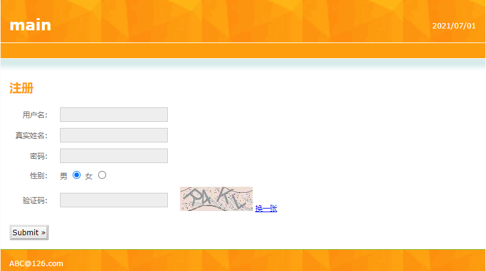

## 解析

运行程序，在地址栏输入测试地址：[http://localhost:8080/Employee_Manage/register.html](http://localhost:8080/Employee_Manage/register.html)后，`UserController.java`返回`data:image/png;base64`，即base64编码的png图片数据：

```java
@GetMapping("/GetVerifyCode")
public String getVerifyCode(HttpServletRequest request) throws IOException {
    .......................
    return "data:image/png;base64," + Base64Utils.encodeToString(byteArrayOutputStream.toByteArray());
} 
```

`register.html`获取验证码：

```html
data: {
    url:""
}

getSrc() {
const _this = this;
axios.get("http://localhost:8080/Employee_Manage/User/GetVerifyCode?time="+Math.random()).then(res=> {
	_this.url = res.data;
	});
}
```

然后在页面展示：

```html
<tr>
    <td valign="middle" align="right">
        验证码:
    </td>
    <td valign="middle" align="left">
        <input type="text" v-model="" class="inputgri" />
    </td>
    <td>
        <!--获取后端产生的验证码base64编码的png图片数据src="data:image/png;base64,/9j...>-->
        
        <a href="javascript:;" @click="getImg">换一张</a>
    </td>
</tr>
```

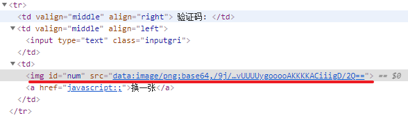

# 用户注册

## 创建用户实体对象

根据[用户表table_user](./项目搭建.md)创建用户实体对象（`entity/User.java`）：

```java
package com.example.entity;

import lombok.Data;
import lombok.experimental.Accessors;

import java.util.Date;

/**
 * @author chenzufeng
 * @date 2021-07-01
 */
@Data
@Accessors(chain = true)
public class User {
    private String id;
    private String name;
    private String realName;
    private String password;
    private String sexual;
    private String status;
    private Date registerTime;
}
```

## Dao层

### UserDao

```java
package com.example.dao;

import com.example.entity.User;
import org.apache.ibatis.annotations.Mapper;

/**
 * @author chenzufeng
 * @date 2021-07-01
 * Mapper用来创建UserDao对象，用于在UserService注入
 */
@Mapper
public interface UserDao {
    /**
     * 用户注册
     * @param user 用户
     */
    void saveUser(User user);
}
```

### UserDaoMapper

```xml
<?xml version="1.0" encoding="UTF-8" ?>
<!DOCTYPE mapper
        PUBLIC "-//mybatis.org//DTD Mapper 3.0//EN"
        "http://mybatis.org/dtd/mybatis-3-mapper.dtd">
<mapper namespace="com.example.dao.UserDao">
    <!--saveUser
        自动生成id并赋值给id-->
    <insert id="saveUser" parameterType="User" useGeneratedKeys="true" keyProperty="id">
        insert into table_user
        values (#{id}, #{name}, #{realName}, #{password}, #{sexual}, #{status}, #{registerTime})
    </insert>
</mapper>
```

## service层

### UserService接口

```java
package com.example.service;

import com.example.entity.User;

/**
 * @author chenzufeng
 * @date 2021-07-01
 */
public interface UserService {
    /**
     * 用户注册
     * @param user 用户
     */
    void register(User user);
}
```

### UserServiceImpl实现类

```java
package com.example.service;

import com.example.dao.UserDao;
import com.example.entity.User;
import org.springframework.beans.factory.annotation.Autowired;
import org.springframework.stereotype.Service;
import org.springframework.transaction.annotation.Transactional;

import java.util.Date;

/**
 * @author chenzufeng
 * @date 2021-07-01
 */
@Service
@Transactional
public class UserServiceImpl implements UserService {
    @Autowired
    private UserDao userDao;

    @Override
    public void register(User user) {
        // 设置用户状态
        user.setStatus("已激活");
        // 设置用户创建时间
        user.setRegisterTime(new Date());
        // 注册用户
        userDao.saveUser(user);
    }
}
```

## controller层

在[UserController](# 开发控制器)中添加`响应网页用户注册`的方法：

```java
package com.example.controller;

import com.example.entity.User;
import com.example.service.UserService;
import com.example.utils.VerifyCodeUtils;
import lombok.extern.slf4j.Slf4j;
import org.springframework.beans.factory.annotation.Autowired;
import org.springframework.util.Base64Utils;
import org.springframework.web.bind.annotation.*;

import javax.servlet.http.HttpServletRequest;
import java.io.ByteArrayOutputStream;
import java.io.IOException;
import java.util.HashMap;
import java.util.Map;

/**
 * @author chenzufeng
 * @date 2021-07-01
 * CrossOrigin：允许跨域
 */
@RestController
@CrossOrigin
@RequestMapping("/User")
@Slf4j
public class UserController {

    @Autowired
    private UserService userService;

    /**
     * 生成验证码
     * @param request request
     * @return 验证码
     * @throws IOException IOException
     */
    @GetMapping("/GetVerifyCode")
    public String getVerifyCode(HttpServletRequest request) throws IOException {
        // 使用工具类生成验证码
        String verifyCode = VerifyCodeUtils.generateVerifyCode(4);
        // 将验证码放入servletContext作用域
        request.getServletContext().setAttribute("verifyCode", verifyCode);
        // 将图片转为base64
        ByteArrayOutputStream byteArrayOutputStream = new ByteArrayOutputStream();
        VerifyCodeUtils.outputImage(120, 40, byteArrayOutputStream, verifyCode);
        // 前端img标签显示base64格式的图片：data:image/png;base64,base64编码的png图片数据
        return "data:image/png;base64," + Base64Utils.encodeToString(byteArrayOutputStream.toByteArray());
    }

    /**
     * 用户注册
     * @param user 用户
     * @param inputVerifyCode 用户输入的验证码
     * @param request request
     * @return Map含注册状态信息
     *
     * 由于axios是以Json字符串形式在传数据，使用RequestBody将Json数据转换成对象
     */
    @PostMapping("UserRegister")
    public Map<String, Object> registerUser(@RequestBody User user, String inputVerifyCode, HttpServletRequest request) {
        log.info("用户信息：{}", user.toString());
        log.info("用户输入的验证码：{}", inputVerifyCode);

        Map<String, Object> map = new HashMap<>();
        try {
            /*
             * 这里"verifyCode"要与
             * getVerifyCode#request.getServletContext().setAttribute("verifyCode", verifyCode)
             * 中"verifyCode"一致
             */
            String verifyCode = (String) request.getServletContext().getAttribute("verifyCode");
            if (verifyCode.equalsIgnoreCase(inputVerifyCode)) {
                // 调用业务方法
                userService.register(user);
                map.put("UserState", true);
                map.put("message", "提示：注册成功！");
            } else {
                throw new RuntimeException("验证码输入错误！");
            }
        } catch (Exception exception) {
            exception.printStackTrace();
            map.put("UserState", false);
            map.put("message", "提示：" + exception.getMessage());
        }
        return map;
    }
}
```

## 注册页面

```html
<!DOCTYPE html PUBLIC "-//W3C//DTD HTML 4.01 Transitional//EN" "http://www.w3.org/TR/html4/loose.dtd">
<html>
<head>
	<title>Register</title>
	<meta http-equiv="Content-Type" content="text/html; charset=UTF-8">
	<link rel="stylesheet" type="text/css" href="css/style.css" />
</head>
<body>
<div id="wrap">
	<div id="top_content">
		<div id="header">
			<div id="rightheader">
				<p>
					2021/07/01
					<br />
				</p>
			</div>
			<div id="topheader">
				<h1 id="title">
					<a href="#">main</a>
				</h1>
			</div>
			<div id="navigation">
			</div>
		</div>
		<div id="content">
			<p id="whereami">
			</p>
			<h1>
				注册
			</h1>
			<form action="login.html" method="post">
				<table cellpadding="0" cellspacing="0" border="0"
					   class="form_table">
					<tr>
						<td valign="middle" align="right">
							用户名:
						</td>
						<td valign="middle" align="left">
							<input type="text" class="inputgri" v-model="user.name"  />
						</td>
					</tr>
					<tr>
						<td valign="middle" align="right">
							真实姓名:
						</td>
						<td valign="middle" align="left">
							<input type="text" class="inputgri" v-model="user.realName"  />
						</td>
					</tr>
					<tr>
						<td valign="middle" align="right">
							密码:
						</td>
						<td valign="middle" align="left">
							<input type="password" class="inputgri" v-model="user.password" />
						</td>
					</tr>

					<tr>
						<td valign="middle" align="right">
							性别:
						</td>
						<td valign="middle" align="left">
							男
							<input type="radio" class="inputgri"  v-model="user.sexual" value="男" checked="checked"/>
							女
							<input type="radio" class="inputgri" v-model="user.sexual"  value="女"/>
						</td>
					</tr>

					<tr>
						<td valign="middle" align="right">
							验证码:
						</td>
						<td valign="middle" align="left">
							<input type="text" v-model="inputVerifyCode" class="inputgri" />
						</td>
						<td>
							<!--获取后端产生的验证码base64编码的png图片数据src="data:image/png;base64,/9j...>-->
							
							<a href="javascript:;" @click="getImg">换一张</a>
						</td>
					</tr>
				</table>

				<p>
					<input type="button" @click="registerUsers" class="button" value="Submit &raquo;" />
				</p>

			</form>
		</div>
	</div>
	<div id="footer">
		<div id="footer_bg">
			ABC@126.com
		</div>
	</div>
</div>
</body>
</html>


<script src="js/vue.js"></script>
<script src="js/axios.min.js"></script>
<script>
	var app = new Vue ({
		el:"#wrap",

		data: {
			url:"",
			user: {
				sexual:"男"
			},
			inputVerifyCode:"",
		},

		methods: {
			// 实现更换验证码
			getImg(){
				this.getSrc();
			},

			// 获取验证码
			getSrc() {
				const _this = this;
				axios.get("http://localhost:8080/Employee_Manage/User/GetVerifyCode?time="+Math.random()).then(res=> {
					_this.url = res.data;
				});
			},

			// 注册用户信息：地址栏传参inputVerifyCode传给UserController#registerUser中inputVerifyCode
			registerUsers() {
				axios.post("http://localhost:8080/Employee_Manage/User/UserRegister?inputVerifyCode=" + this.inputVerifyCode, this.user).then(res=> {
					console.log(res.data);
                    		    // UserState要与UserController中registerUser#map.put("UserState", true);中UserState一致
					if (res.data.UserState) {
						// message要与UserController中registerUser#map.put("message", "提示：注册成功！");"message"一致
						alert(res.data.message + "，点击确定跳转至登录页面！");
						location.href="login.html";
					} else {
						alert(res.data.message + "注册失败！");
					}
				});
			}
		},

		created() {
			// 获取验证码
			this.getSrc();
		}

	})
</script>
```

## 解析

```html
<tr>
    <td valign="middle" align="right">
        验证码:
    </td>
    <td valign="middle" align="left">
        <input type="text" v-model="inputVerifyCode" class="inputgri" />
    </td>
    <td>
        <!--获取后端产生的验证码base64编码的png图片数据src="data:image/png;base64,/9j...>-->
        
        <a href="javascript:;" @click="getImg">换一张</a>
    </td>
</tr>
```

`register.html`将输入的验证码（`v-model="inputVerifyCode"`），通过`Post`方式地址栏传参提交给后台：

```html
// 注册用户信息：地址栏传参inputVerifyCode传给UserController#registerUser中inputVerifyCode
registerUsers() {
    axios.post("http://localhost:8080/Employee_Manage/User/UserRegister?inputVerifyCode=" + this.inputVerifyCode, this.user).then(res=> {
        console.log(res.data);
        if (res.data.UserState) {
            // message要与UserController中registerUser#map.put("message", "提示：注册成功！");"message"一致
            alert(res.data.message + "，点击确定跳转至登录页面！");
            location.href="login.html";
        } else {
            alert(res.data.message + "注册失败！");
        }
    });
}
```

`UserController.java`返回包含`注册状态`信息的`Map`：

```java
@PostMapping("UserRegister")
public Map<String, Object> registerUser(@RequestBody User user, String inputVerifyCode, HttpServletRequest request) {
    log.info("用户信息：{}", user.toString());
    log.info("用户输入的验证码：{}", inputVerifyCode);

    Map<String, Object> map = new HashMap<>();
    try {
        /*
         * 这里"verifyCode"要与
         * getVerifyCode#request.getServletContext().setAttribute("verifyCode", verifyCode)
         * 中"verifyCode"一致
         */
        String verifyCode = (String) request.getServletContext().getAttribute("verifyCode");
        if (verifyCode.equalsIgnoreCase(inputVerifyCode)) {
            // 调用业务方法
            userService.register(user);
            map.put("UserState", true);
            map.put("message", "提示：注册成功！");
        } else {
            throw new RuntimeException("验证码输入错误！");
        }
    } catch (Exception exception) {
        exception.printStackTrace();
        map.put("UserState", false);
        map.put("message", "提示：" + exception.getMessage());
    }
    return map;
}
```

## 验证

启动项目，浏览器地址栏输入[http://localhost:8080/Employee_Manage/register.html](http://localhost:8080/Employee_Manage/register.html)

### 注册失败

先不注册信息，点击`Submit`：

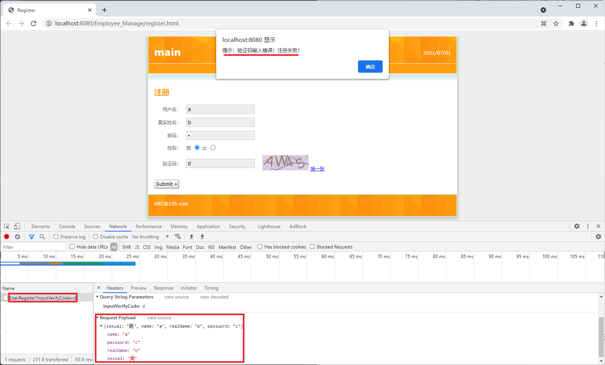

由于`UserController.java`中的设置：

```java
log.info("用户信息：{}", user.toString());
log.info("用户输入的验证码：{}", inputVerifyCode);

String verifyCode = (String) request.getServletContext().getAttribute("verifyCode");
    if (verifyCode.equalsIgnoreCase(inputVerifyCode)) {
        // 调用业务方法
        userService.register(user);
        map.put("UserState", true);
        map.put("message", "提示：注册成功！");
    } else {
        throw new RuntimeException("验证码输入错误！");
    }
} catch (Exception exception) {
    exception.printStackTrace();
    map.put("UserState", false);
    map.put("message", "提示：" + exception.getMessage());
}
```

IDEA控制台输出：

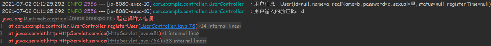

由于`register.html`设置了

```html
registerUsers() {
    axios.post("http://localhost:8080/Employee_Manage/User/UserRegister?inputVerifyCode=" + this.inputVerifyCode, this.user).then(res=> {
        console.log(res.data);
	// UserState要与UserController中registerUser#map.put("UserState", true);中UserState一致
        if (res.data.UserState) {
            // message要与UserController中registerUser#map.put("message", "提示：注册成功！")中"message"一致
            alert(res.data.message + "，点击确定跳转至登录页面！");
            location.href="login.html";
        } else {
            alert(res.data.message + "注册失败！");
        }
    });
}
```

`F12`查看`Console`时输出（`console.log(res.data);`）：

```markdown
{UserState: false, message: "提示：验证码输入错误！"}
```

由于设置`alert(res.data.message + "注册失败！");`，所以注册失败时：

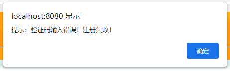

### 注册成功

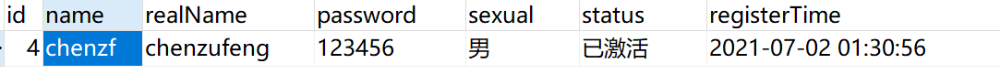

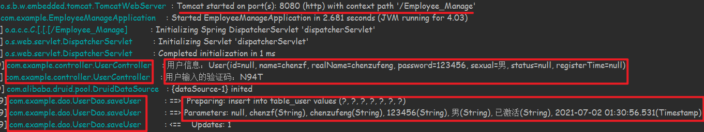

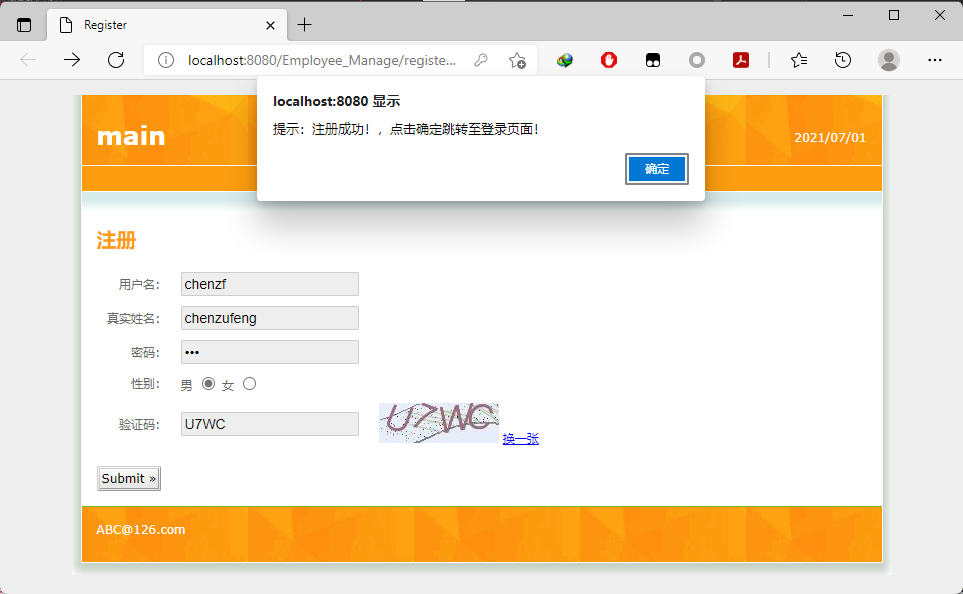

# 用户查找

现有代码在注册相同用户时，无法阻止相同用户注册。因此，可以实现`按realName查询用户`功能，当注册用户时，如果`realName`相同，则无需再注册！

## 修改dao层

在`UserDao`中添加`findUserByRealName`：

```java
/**
 * 根据用户真实名字查找用户
 * @param realName 用户真实名
 * @return User
 */
User findUserByRealName(String realName);
```

在`UserDaoMapper.xml`中添加`findUserByRealName`SQL语句：

```xml
<select id="findUserByRealName" parameterType="String" resultType="User">
    select id, name, realName, password, sexual, status, registerTime
    from table_user where realName = #{realName}
</select>
```

## 修改service层

修改`UserServiceImpl`注册方法，添加`判断`逻辑：

```java
public void register(User user) {
    // 根据用户输入的真实名字判断用户是否已注册
    User userFoundByRealName = userDao.findUserByRealName(user.getRealName());
    if (userFoundByRealName == null) {
        // 设置用户状态
        user.setStatus("已激活");
        // 设置用户创建时间
        user.setRegisterTime(new Date());
        // 注册用户
        userDao.saveUser(user);
    } else {
        throw new RuntimeException("用户已存在！");
    }
}
```

## 验证与分析

地址栏输入[http://localhost:8080/Employee_Manage/register.html](http://localhost:8080/Employee_Manage/register.html)，注册时填写相同的真实姓名：

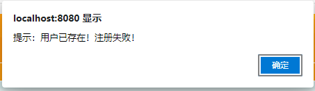

在页面点击`Submit`，根据

```html
<p>
    <input type="button" @click="registerUsers" class="button" value="Submit &raquo;" />
</p>

// 注册用户信息：地址栏传参inputVerifyCode传给UserController#registerUser中inputVerifyCode
registerUsers() {
    axios.post("http://localhost:8080/Employee_Manage/User/UserRegister?inputVerifyCode=" + this.inputVerifyCode, this.user).then(res=> {
        console.log(res.data);
        // UserState要与UserController中registerUser#map.put("UserState", true);中UserState一致
        if (res.data.UserState) {
            // message要与UserController中registerUser#map.put("message", "提示：注册成功！");"message"一致
            alert(res.data.message + "，点击确定跳转至登录页面！");
            location.href="login.html";
        } else {
            alert(res.data.message + "注册失败！");
        }
    });
}
```

可知，后台`UserController`进行相应，进入`registerUser`方法：

```java
@PostMapping("UserRegister")
public Map<String, Object> registerUser(@RequestBody User user, String inputVerifyCode, HttpServletRequest request) {
	...............
        try {
        /*
         * 这里"verifyCode"要与
         * getVerifyCode#request.getServletContext().setAttribute("verifyCode", verifyCode)
         * 中"verifyCode"一致
         */
        String verifyCode = (String) request.getServletContext().getAttribute("verifyCode");
        if (verifyCode.equalsIgnoreCase(inputVerifyCode)) {
            // 调用业务方法
            userService.register(user);
            map.put("UserState", true);
            map.put("message", "提示：注册成功！");
        } else {
            throw new RuntimeException("验证码输入错误！");
        }
    } catch (Exception exception) {
        exception.printStackTrace();
        map.put("UserState", false);
        map.put("message", "提示：" + exception.getMessage());
    }
    return map;
}
```

该方法调用了`userService.register(user)`：

```java
public void register(User user) {
    // 根据用户输入的真实名字判断用户是否已注册
    User userFoundByRealName = userDao.findUserByRealName(user.getRealName());
    if (userFoundByRealName == null) {
        // 设置用户状态
        user.setStatus("已激活");
        // 设置用户创建时间
        user.setRegisterTime(new Date());
        // 注册用户
        userDao.saveUser(user);
    } else {
        throw new RuntimeException("用户已存在！");
    }
}
```

如果注册的用户已存在，则抛出异常`RuntimeException("用户已存在！")`。`register.html`页面执行`alert(res.data.message + "注册失败！")`！


# 用户登录

<font color=red>修改“用户查找”——按用户名查找，而非真实名！</font>

用户输入“用户名”和“密码”进行登录，如果能从“用户表”中找到该用户，则进入员工信息列表；否则，提示用户不存在，需要进行注册！

## 修改业务层

在`UserService`接口中添加“登录”方法：

```java
/**
 * 用户登录
 * @param user 用户
 * @return 用户信息
 */
User login(User user);
```

在`UserServiceImpl`中实现“登录”方法：

```java
/**
 * 用户登录
 * @param user 用户
 * @return 用户
 */
@Override
public User login(User user) {
    // 根据用户输入的用户名进行查询
    User userFoundByName = userDao.findUserByName(user.getName());
    // 输入的用户存在
    if (! ObjectUtils.isEmpty(userFoundByName)) {
        // 验证密码是否正确
        if (userFoundByName.getPassword().equals(user.getPassword())) {
            return userFoundByName;
        } else {
            throw new RuntimeException("密码输入错误！");
        }
    } else {
        throw new RuntimeException("输入的用户不存在，请重新输入或进行注册！");
    }
}
```

## 修改控制层

在`UserController`中添加登录方法（接受请求，调用业务）：

```java
/**
 * 用户登录：填入的用户在用户表中，为成功
 * @param user 用户
 * @return 登录状态信息
 */
@PostMapping("UserLogin")
public Map<String, Object> login(@RequestBody User user) {
    log.info("当前登录用户的信息：{}", user.toString());
    Map<String, Object> map = new HashMap<>();
    try {
        User existUser = userService.login(user);
        map.put("state", true);
        map.put("message", "登录成功！");
        map.put("User", existUser);
    } catch (Exception exception) {
        exception.printStackTrace();
        map.put("state", false);
        map.put("message", exception.getMessage());
    }
    return map;
}
```

## 登录页面

特别注意`登录`按钮：

```html
<div id="wrap">

<p>
    <!--原文件<input type="submit" class="button" value="登录" />-->
    <input type="button" @click="login" class="button" value="登录" />
    &nbsp;&nbsp;
    <a href="register.html">去注册</a>
</p>
    
<form action="emplist.html" method="post">
    <table cellpadding="0" cellspacing="0" border="0"
        class="form_table">
        <tr>
            <td valign="middle" align="right">
                用户姓名:
            </td>
            <td valign="middle" align="left">
                <input type="text" class="inputgri" v-model="user.name" name="name" />
            </td>
        </tr>
        <tr>
            <td valign="middle" align="right">
                用户密码:
            </td>
            <td valign="middle" align="left">
                <input type="password" class="inputgri" v-model="user.password" name="pwd" />
            </td>
        </tr>
    </table>
    <p>
        <!--原文件<input type="submit" class="button" value="登录" />-->
        <input type="button" @click="login" class="button" value="登录 &raquo;" />
        &nbsp;&nbsp;
        <a href="register.html">去注册</a>
    </p>
</form>
```


```html
<script src="js/vue.js"></script>
<script src="js/axios.min.js"></script>

<script>
	var app = new Vue ({
		el: "#wrap",

		data: {
			// 用来保存用户数据
			user:{},
		},

		methods: {
			// 用户登录
			login() {
				// 发送登录请求
				axios.post("http://localhost:8080/Employee_Manage/User/UserLogin", this.user).then(res=>{
					console.log(res.data);
					if (res.data.state) {
						alert(res.data.message + "，点击确定进入员工列表！");
						// 将登录用户信息放入localStorage(key value)，浏览器保留当前登录的用户信息
						// 这里的res.data.User是UserController#login返回的map，要与map.put("User", existUser)中User一致
						localStorage.setItem("user", JSON.stringify(res.data.User));
						location.href="emplist.html";
					} else {
						alert(res.data.message);
						location.href="login.html";
					}
				});
			}
		}
	});
</script>
```


## 在员工列表下显示用户视角

为了在员工列表下，显示用户视角（显示`Welcome XXX!`），需要将登录的用户信息保存在浏览器中，可以使用`Local Storage`：

```html
// 将登录用户信息放入localStorage(key value)，浏览器保留当前登录的用户信息
// 这里的res.data.User是UserController#login返回的map，要与map.put("User", existUser)中User一致
localStorage.setItem("user", JSON.stringify(res.data.User));
```

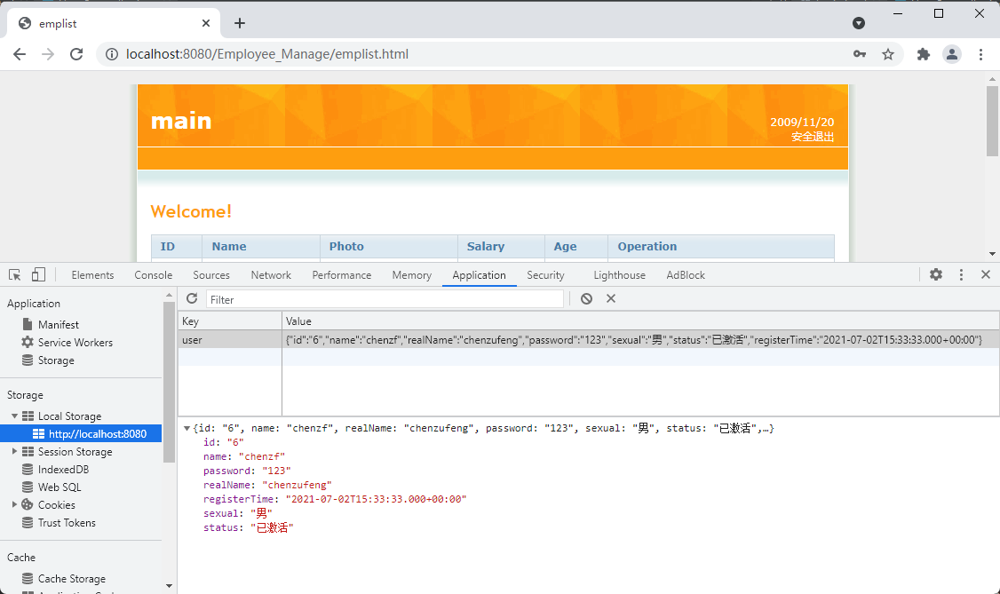

浏览器已经获取了当前登录用户的信息，该如何将其展现在`用户列表`页面？

### 修改emplist.html

```html
<h1>
    <!--Welcome !-->
    Welcome {{user.realName}} !
</h1>

<script src="js/vue.js"></script>
<script src="js/axios.min.js"></script>

<script>
	var app = new Vue ({
		el: "#wrap",

		data: {
			user: {},
		},

		methods: {},

		// 生命周期函数
		created() {
			const userString = localStorage.getItem("user");
			if (userString) {
				// const user = JSON.parse(userString);
				this.user = JSON.parse(userString);
				console.log(JSON.parse(userString));
			} else {
				alert("您尚未登录，点击确定跳转至登录页面！");
				location.href = "login.html";
			}
		}
	});
</script>
```

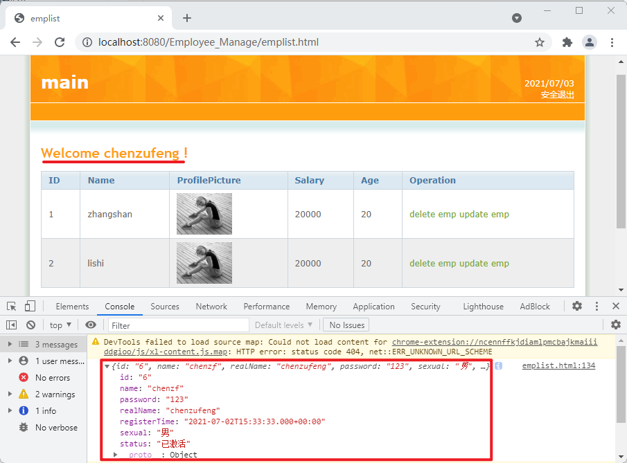

如果用户没有登录，则跳转至`员工登录`页面：

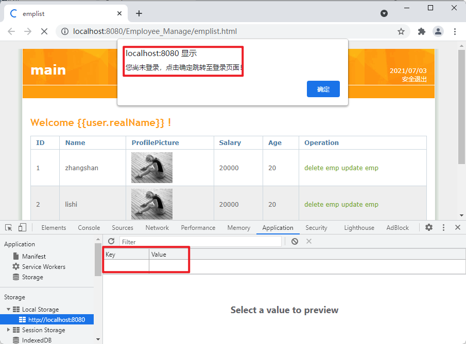

### 安全退出

修改`emplist.html`：

```java
<p>
    2021/07/03
    <br />
    <!--安全退出-->
    <a href="javascript:;" @click="logout">安全退出</a>
</p>
    
methods: {
    // 安全退出
    logout() {
        localStorage.removeItem("user");
        location.reload();
    }
}
```


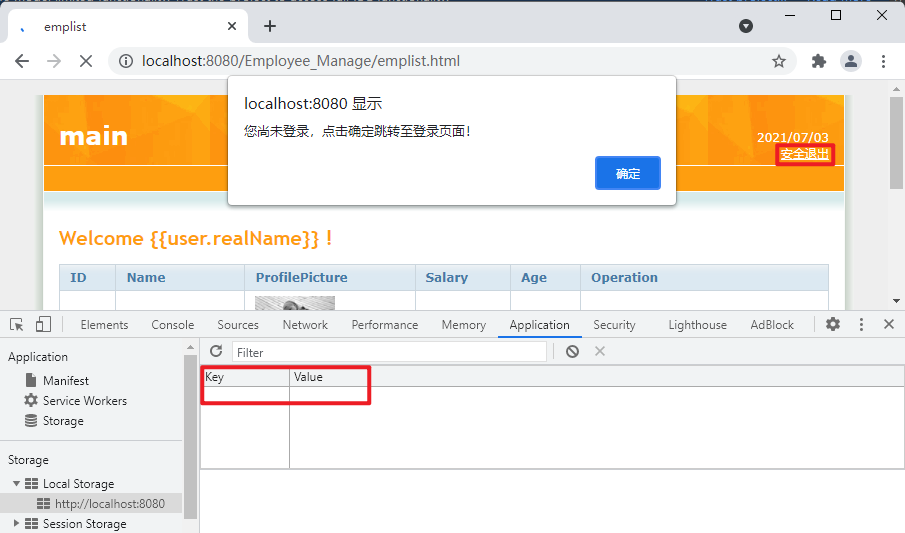


