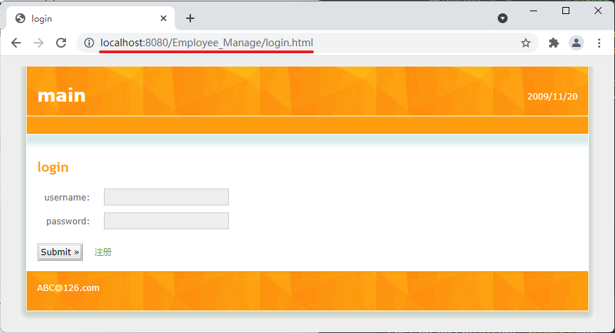

# 库表设计

创建数据库：


```sql
CREATE DATABASE `Employee_Manage` CHARACTER SET 'utf8';
```

创建表：

```sql
-- ----------------------------
-- Table structure for table_employee
-- ----------------------------
DROP TABLE IF EXISTS `table_employee`;
CREATE TABLE `table_employee`  (
  `id` int(6) NOT NULL AUTO_INCREMENT,
  `name` varchar(10) CHARACTER SET utf8 COLLATE utf8_general_ci NULL DEFAULT NULL,
  `profilePicturePath` varchar(40) CHARACTER SET utf8 COLLATE utf8_general_ci NULL DEFAULT NULL,
  `salary` double(10, 2) NULL DEFAULT NULL,
  `age` int(3) NULL DEFAULT NULL,
  PRIMARY KEY (`id`) USING BTREE
) ENGINE = InnoDB AUTO_INCREMENT = 1 CHARACTER SET = utf8 COLLATE = utf8_general_ci ROW_FORMAT = Compact;

-- ----------------------------
-- Table structure for table_user
-- ----------------------------
DROP TABLE IF EXISTS `table_user`;
CREATE TABLE `table_user`  (
  `id` int(6) NOT NULL AUTO_INCREMENT,
  `name` varchar(10) CHARACTER SET utf8 COLLATE utf8_general_ci NULL DEFAULT NULL,
  `realName` varchar(10) CHARACTER SET utf8 COLLATE utf8_general_ci NULL DEFAULT NULL,
  `password` varchar(10) CHARACTER SET utf8 COLLATE utf8_general_ci NULL DEFAULT NULL,
  `sexual` varchar(10) CHARACTER SET utf8 COLLATE utf8_general_ci NULL DEFAULT NULL,
  `status` varchar(4) CHARACTER SET utf8 COLLATE utf8_general_ci NULL DEFAULT NULL,
  `registerTime` timestamp NOT NULL DEFAULT CURRENT_TIMESTAMP ON UPDATE CURRENT_TIMESTAMP,
  PRIMARY KEY (`id`) USING BTREE
) ENGINE = InnoDB AUTO_INCREMENT = 1 CHARACTER SET = utf8 COLLATE = utf8_general_ci ROW_FORMAT = Compact;

```


# 工程创建

## 创建新工程


## 添加依赖


## 调整结构


## 引入druid依赖

引入`druid`后，需要`Load Maven Changes`！

```xml
<dependencies>
    <dependency>
        <groupId>org.springframework.boot</groupId>
        <artifactId>spring-boot-starter-web</artifactId>
    </dependency>

    <dependency>
        <groupId>org.mybatis.spring.boot</groupId>
        <artifactId>mybatis-spring-boot-starter</artifactId>
        <version>2.2.0</version>
    </dependency>

    <dependency>
        <groupId>org.springframework.boot</groupId>
        <artifactId>spring-boot-devtools</artifactId>
        <scope>runtime</scope>
        <optional>true</optional>
    </dependency>

    <dependency>
        <groupId>mysql</groupId>
        <artifactId>mysql-connector-java</artifactId>
        <scope>runtime</scope>
    </dependency>

    <dependency>
        <groupId>org.projectlombok</groupId>
        <artifactId>lombok</artifactId>
        <optional>true</optional>
    </dependency>

    <dependency>
        <groupId>org.springframework.boot</groupId>
        <artifactId>spring-boot-starter-test</artifactId>
        <scope>test</scope>
    </dependency>

    <dependency>
        <groupId>com.alibaba</groupId>
        <artifactId>druid</artifactId>
        <version>1.2.6</version>
    </dependency>
</dependencies>
```

## 配置application.properties

```properties
# 访问项目名
server.servlet.context-path=/Employee_Manage
server.port=8080

# 项目名
spring.application.name=EmployeeManage

spring.datasource.type=com.alibaba.druid.pool.DruidDataSource
spring.datasource.driver-class-name=com.mysql.cj.jdbc.Driver
spring.datasource.url=jdbc:mysql://localhost:3306/employee_manage?characterEncoding=UTF-8
spring.datasource.username=root
spring.datasource.password=120618

mybatis.mapper-locations=classpath:com/example/mapper/*.xml
mybatis.type-aliases-package=com.example.entity

logging.level.com.example.dao=debug
logging.level.com.example.service=info
logging.level.com.example.controller=info
```

## 向static中导入静态资源


# 验证项目

根据设置的路径访问静态资源验证项目（打开`EmployeeManageApplication`，运行项目），打开浏览器，输入地址：[http://localhost:8080/Employee_Manage/login.html](http://localhost:8080/Employee_Manage/login.html)




